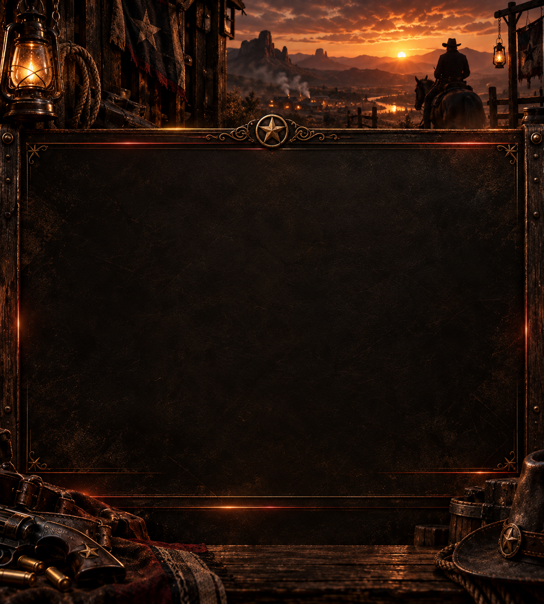
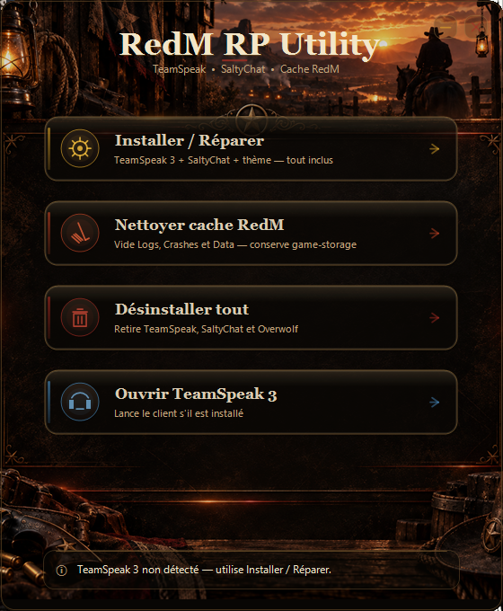
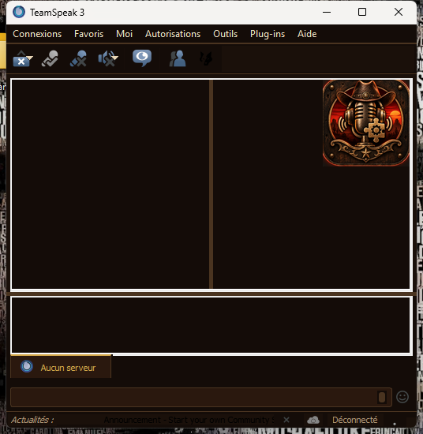

# RedM RP Utility

<p align="center">
  
</p>

**Stack:** C# · .NET 8 · WinForms

**Utilitaire Windows pour le vocal Roleplay RedM** — installe, configure et répare **TeamSpeak 3 + SaltyChat**, applique un thème Red Dead, et nettoie le cache RedM, le tout depuis une seule application.

---

## À quoi ça sert ?

Sur RedM (GTA RP / RDR RP), le proximity chat passe souvent par **TeamSpeak + SaltyChat**.  
L’installation manuelle est longue : télécharger TeamSpeak, éviter Overwolf, installer le plugin, régler le micro, le casque, le Push-To-Talk, le thème, etc.

**RedM RP Utility** automatise tout ça :

| Besoin | Ce que fait le logiciel |
|---|---|
| Vocal RP prêt à jouer | Installe TeamSpeak 3 **sans Overwolf** + SaltyChat + thème |
| Config audio correcte | Assistant micro / casque / **Push-To-Talk** (pas le mode détection de voix) |
| RedM qui rame / bugs cache | Nettoie les caches RedM **sans toucher** à `game-storage` |
| Repartir de zéro | Désinstalle TeamSpeak, SaltyChat et Overwolf en un clic |
| Lancer TS rapidement | Bouton pour ouvrir TeamSpeak s’il est installé |

En résumé : **un hub simple pour préparer le vocal RP RedM**, sans galérer avec les installateurs et les réglages.

---

## Fonctionnalités

- **Installer / Réparer** — TeamSpeak 3 + SaltyChat + thème Red Dead
- **Nettoyer cache RedM** — Logs / Crashes / Data (conserve la sauvegarde `game-storage`)
- **Désinstaller tout** — TeamSpeak, SaltyChat, Overwolf (RedM n’est pas touché)
- **Ouvrir TeamSpeak 3** — lance le client détecté
- Interface **borderless** style western / Red Dead
- Pas de fenêtre PowerShell visible pendant l’installation

---

## Captures / aperçu

<p align="center">
  
</p>

<p align="center">
  
</p>

---

## Prérequis

- Windows **10 / 11** (64-bit)
- Droits utilisateur standard (pas besoin d’admin dans le cas normal)
- RedM installé si tu veux utiliser le nettoyage de cache

---

## Installation

### Option recommandée — Setup

1. Télécharge la dernière release : **[RedM-RP-Utility-Setup.exe](https://github.com/He4TheR-Dev/RedM-RP-Utility/releases/latest)**
2. Lance l’installateur
3. Ouvre **RedM RP Utility** depuis le Bureau
4. Clique **Installer / Réparer**
5. Choisis ton micro, ton casque et ta touche PTT
6. Attends la fin, puis ouvre TeamSpeak

### Option portable

1. Prends `RedMRpUtility.exe` **avec** le dossier `Assets`
2. Lance l’exe  
   *(les redist / scripts doivent être présents comme après une install Setup)*

---

## Utilisation

1. Lance **RedM RP Utility**
2. Vérifie le statut en bas :
   - point vert → TeamSpeak détecté
   - sinon → utilise **Installer / Réparer**
3. Utilise les cartes d’action selon ton besoin

---

## Désinstallation

- **Retirer TeamSpeak / SaltyChat / Overwolf** → bouton **Désinstaller tout** dans l’app  
- **Retirer l’utilitaire** → Paramètres Windows → Applications → *RedM RP Utility*

---

## Versions incluses

| Composant | Version |
|---|---|
| RedM RP Utility | 2.1.x |
| TeamSpeak 3 Client | 3.6.2 |
| SaltyChat | 4.1.0 |

---

## Structure du projet (source)

```
├── hub/VocalRoleplay/     # App WinForms (.NET 8) — code C#
├── installer/             # Inno Setup + scripts PowerShell + thème
│   └── redist/            # SaltyChat, thème… (pas TeamSpeak3-Setup.exe ≈108 Mo)
├── assets/                # Previews README
├── LICENSE
└── README.md
```

> Le setup public complet (avec TeamSpeak embarqué) est sur **Releases**.  
> Pour rebuild local : place `TeamSpeak3-Setup.exe` dans `installer/redist/` (voir `installer/redist/README.md`).

### Build (développement)

```bash
dotnet publish hub/VocalRoleplay/VocalRoleplay.csproj -c Release -r win-x64 --self-contained true -o hub/publish
# Puis compiler installer/setup.iss avec Inno Setup 6
```

---

## Avertissements

- Cet outil configure **ton** TeamSpeak / SaltyChat pour le roleplay. Il ne remplace pas les règles de ton serveur.
- Ferme TeamSpeak avant une install / réparation / désinstallation si l’app le demande.
- Le nettoyage RedM ne supprime **pas** `game-storage` (inventaire / progressions liées).

---

## Licence

**Copyright (c) 2026 HE4THER DEV (He4TheR-Dev)**

MIT — voir [LICENSE](LICENSE).

---

## Crédits

- TeamSpeak 3 — [TeamSpeak Systems](https://www.teamspeak.com/)
- SaltyChat — plugin vocal FiveM/RedM
- Interface, code & packaging — Copyright (c) 2026 [HE4THER DEV](https://github.com/He4TheR-Dev)
